# ExplicitGenomeSpeciation

An individual-based simulation of an adaptive speciation event, with explicit full genomes and quantitative genetics.

## Model

### Environment

There are two habitats connected by dispersal, labelled 0 and 1. Two resources are present across the lanscape, also labelled 0 and 1. We assume that resource are not necessarily equally distributed between the habitats, but can be asymmetrically distributed. Resource 0 is the most abundant resource in habitat 0, while resource 1 is most abundant in habitat 1. The concentration of the most abundant resource is the same in each habitat. The least abundant resource in each habitat has a concentration that is a proportion `hsymmetry` of that of the most abundant resource, where `hsymmetry` can range from 0 (resources are equally distributed between habitats) to 1 (there is only one resource available in each habitat). The concentration of the least abundant resource is also the same between the habitats.

### Genetic architecture

#### Development

Every individual in the simulation is generated with a number of features, including phenotypic traits that are generated from explicit full genomes. We model three traits, *x*, an ecological trait determining the attack rates of an individual on both resources, *y*, a mate preference trait used in reproduction, and *z*, a neutral trait with no particular function, to serve as a control. Each individual bears a full diploid genome of `nloci` genes, where each gene is represented by two bits, one for each haplotype. Each bit is an allele at this particular gene. The possible genotypes at any given gene are therefore *00*, *01* and *11*.  

Each phenotypic trait is encoded by multiple genes during embryonic development. The number of genes underlying each trait is given by `nvertices`, a vector of length three. The sum of the elements in `nvertices` is `nloci`. The genes underlying a given trait are scattered uniformly across the genome. This is done by shuffling randomly a vector of length `nloci` with elements indicating encoded traits, where each trait is present in a number of copies determined in `nvertices`. The value of a given trait for a given individual is the sum of an environmental and a genetic effect. The environmental effect is modelled as noise, sampled from a normal distribution with mean zero and standard deviation given by `scaleE` (which is a vector with one value per trait). The genetic effect is calculated as a sum of contributions from all the genes that code for the trait. The contribution of a single gene to the phenotype it encodes is the genetic value of that gene, denoted *g<sub>ik</sub>* for locus *i* in individual *k*, and is computed as:


where  is the effect size of locus *i* on its own,  is the effect size of the epistatic interaction between gene *i* and *j* (both genes code for the same trait), and *e<sub>ik</sub>* is the gene expression level of locus *i* in individual *k*. The first term of the equation can be seen as the independent contribution of locus *i*, while the second term incorporates the effect of interactions with other genes in the genome. Parameters  and  are scaling parameters for both the independent part and the epistatic part, and are given by `scaleA` and `scaleI` (they both are vectors of length three, one value per trait).  and  are part of the genetic architecture, which is fixed throughout the simulation (it cannot evolve) and is determined before the simulation starts. Values of  are sampled for each locus from a two-sided Gamma distribution with parameters `effectshape` and `effectscale`, which are constant across the genome. Some genes therefore have positive and others negative contributions to the final trait value. For each pair of interacting genes,  is also sampled from a two-sided Gamma distribution, with parameters `interactionshape` and `interactionscale`, which are also constant across all gene-gene interactions. The effect of any given interaction is distributed equally between the two partner genes, hence the 1/2 factor.  

The gene expression level *e<sub>ik</sub>* depends on the genotype of individual *k* at locus *i*. We assume that genotypes *00* have an expression level of -1 and genotypes *11* have an expression level of 1, thereby viewing alleles *0* and *1* as inactive *versus* active, or inhibiting *versus* enhancing, versions of genes. The expression level of heterozygous genotype *01* (we do not make a difference between *01* and *10*) is , where *h<sub>i</sub>* is the dominance coefficient at locus *i*, and  is a scaling parameter determined by `scaleD` (again one value for each trait). Dominance coefficients are part of the fixed genetic architecture and are sampled at the beginning of the simulation, for each locus, from a positive half-normal distribution, where the underlying normal distribution has mean zero and standard deviation `dominancevar`. Dominance coefficients therefore reflect the dominance of allele *1* over allele *0*, such that if *h<sub>i</sub> = 0*, the expression level of the heterozygote is exactly 0, and expression gets closer to 1 as *h<sub>i</sub>* gets closer to 1. WEIRD that expression of the heterozygote cannot be negative.  

Once the trait values of the genetically encoded phenotypes are known, the attack rates of a given individual on a given resource *r* (0 or 1) are calculated from its ecological trait value *x* as:


where *s* is the ecological selection coefficient, a parameter controlled by `ecosel`, and *x<sub>r</sub><sup>*</sup>* is the value of the ecological trait *x* for which the attack rate on resource *r* is maximized. In other words, it is the optimal trait value for feeding on resource *r*. We assume that *x<sub>0</sub><sup>*</sup>* = -1 and *x<sub>1</sub><sup>*</sup>* = 1. The ecological selection coefficient *s* determines the strength of the trade-off between being adapted to resource 0 and being adapted to resource 1. Disruptive selection can be modelled by increasing *s*. As *s* increases, the overlap between the two Gaussian attack rate curves along the *x* axis decreases. This means that individuals with intermediate value of the *x* (close to 0) phenotype will have poor attack rates on both resources, while individuals with extreme values (close to -1 or 1) have high attack rates on one of the two resources, and have a higher payoff than intermediate individuals, who will be selected against. If *s = 0*, there is no selection and the attack rate on both resources is 1, regardless of the value of *x*.

#### Gene interaction networks

Which genes interact together in epistasis is determined at the beginning of the simulation and is part of the fixed genetic architecture. Each trait is underlain by a network, which can be seen as a developmental gene regulatory network, where nodes are the genes coding for the trait and edges are gene-gene interactions. We model only pairwise interactions between genes. The same genes can be involved in multiple interactions. Interactions are only possible between loci encoding the same trait, so the three networks are independent. The number of edges in each network is determined by `nedges` (one value per trait). Not all nodes within a network, i.e. underlying a given trait, need be involved in epistatic interactions, e.g. if the number of edges is small relative to the number of nodes defined in `nvertices`. However, for a given number of nodes *N* there is a maximum number of pairwise interactions that the network can have, *N (N - 1) / 2*. In our simulation the number of edges is capped to this maximum if the supplied number `nedges` exceeds it.  

The topology of the network is determined by a preferential attachment algorithm, in which a network grows incrementally from a single edge between two nodes, by grafting new nodes to the already connected nodes. Each new node attaches to a number of partners, which is sampled from a binomial distribution with *E* events and probability *1 / N*, where *E* is the number of edges yet to be added to the network, and *N* is the number of nodes still not attached to it (*E* and *N* are updated as the network grows). Thus, every new node can attach to multiple partners when grafting onto the network, but can also not attach to any partner. Under this process the later nodes in the queue will be involved in more attachments, such that the number of required edges is guaranteed to be be reached by the time the last node in the queue is reached (if it is reached, it will make all the edges yet to be made). The required number of edges could also be reached before reaching the end of the queue of nodes, in which case the later nodes in the queue remain without partners.  

Once the number of partners of a single node is sampled, which partner it attaches to is sampled without replacement from the set of already attached nodes, with probabilities proportional to the degree of each node (i.e. the number of edges a node is already involved in) to a power exponent defined in `skewnesses` (one value per trait), which controls the skewness of the degree distribution of the resulting network. If the value of this exponent is smaller than 1, the degree distribution of the corresponding network will be a stretched exponential distribution and edges will be more evenly distributed across the nodes. As the skewness goes above one, the network will converge to a star-shaped topology, where few nodes make up most of the edges and most nodes remain peripheral and poorly connected.
 
### Initialization

The founder population is populated with a certain number of individuals in each of the two habitats, defined by ```demesizes```. Founder individuals are generated with random genomes, where the frequency of allele *1* is on average `allfreq`. Because the trait values are the result of the genotype-phenotype map, they may span a large range in the first time steps if genetic diversity is high and random. This is not suitable for modelling e.g., a population that colonizes a new ecological niche, or resource, from a niche it is already adapted to. To model this scenario we incorporate a burn-in period in our simulation (of duration ```tburnin```), during which only resource 0 is available for use and there is no dispersal. If the population is initialized with all individuals in habitat 0, the burn-in period should canalize the population to specializing on resource 0, with ecological trait values gathered around -1. Once the burn-in period is over, the simulation runs for ```tend``` time steps where dispersal is allowed and both resources are available.

### Life cycle

The dynamics of the population unfold in discrete time. At every time step, the following events occur in the corresponding order: dispersal, consumption, reproduction and survival.

#### Dispersal

Every individual can migrate to the alternative habitat with probability ```dispersal```. There is no dispersal during the burn-in period.

#### Consumption

We assume that the resource dynamics are fast relative to the population dynamics. We calculate the equilibrium concentrations of each resource in each habitat as a steady state of the resource dynamics. We provide two ways to model resource flows: logistic (`rdynamics` = 0) or chemostat (`rdynamics` = 1) dynamics. The logistic dynamics are characterized by the following differential equation:


where *R* is the concentration of a given resource in a given habitat, *r* is the replenishment rate of the resource, *K* is the carrying capacity, and *C* is the consumption rate from the population. *C* is calculated as the sum of attack rates on this resource of all individuals in the present habitat. The chemostat dynamics are characterized by the equation:


where *a* is the rate of inflow of resource in the habitat and *b* the rate of outflow. *C* is calculated the same way as for the logistic dynamics. The equilibrium concentration of the resource can be written as:

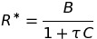

where 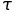 = *1 / b* is the renewal time of the resource, and *B* = *a*  is the per capita birth rate of the consumer population. These two parameters are provided to the simulation by `renewal` and `birth`, respectively. In the simulation, the resource equilibrium is actually computed relative to `birth`, as the second factor of the equation only.

The fitness of each individual is calculated as:


where *e<sub>0</sub>* and *e<sub>1</sub>* are the attack rates of the individual on each resource, given its ecological trait value *x*, and *R<sub>0</sub><sup>*</sup>* and *R<sub>1</sub><sup>*</sup>* are the equilibrium concentrations of the two resources in the individual's habitat. Note that only resource 0 is available during the burn-in period.

#### Mating

The fitness of individuals determines their reproductive success. At every generation, a mating seasons occurs for a number of discrete rounds, where females can choose males to mate with. It is possible that females remain unmated at the end of a mating season. The duration of the mating season is sampled each generation from a geometric distribution with parameter `matingcost`, which is the probability that the mating season will end after a given round. We recommend low values of `matingcost`, as to not strongly select against choosy females (who run high chances of not finding a mate if the mating season is too short).  

At each round of the mating season, females are presented with a male to assess. The probability of a male to encounter and being assessed by a females relative to other males is proportional to its fitness. Once encountered, the male is evaluated by the female, who can either accept or reject him as a mate. Once a female accepts a mate, the mating season ends for her and she produces a number of offspring sampled from a Poisson distribution with mean *f* `birth`, where `birth` is a baseline birth rate and *f* the fitness of the female.  

The probability to accept a given male depends on the female's mate preference *y* and on the male's ecological trait *x* value relative to her own. Positive values of *y* will favor assortative mating, i.e. with males that are more similar in ecological trait, while negative values will favor disassortative mating, i.e. with males that are more dissimilar in ecological trait. If *y = 0*, mating is random and the female will accept the first male she encounters. Specifically, the mating probability of female *i* with male *j* is given, for *y > 0*, by:


where  is the strength of sexual selection exerted by the females, controlled by parameter `sexsel` in the simulation. The mating probability in case *y < 0* is:


#### Reproduction

Each offspring is a zygote resulting from the fecundation event between the gametes of its two parents. The gametes are produced by the parents through meiosis, during which recombination between the two strings of diploid DNA produces the haploid genome of a gamete. The genome is split in `nchrom` chromosomes, which recombine freely with each other, and therefore a gamete has equal chances to contain either copy of each parental chromosome. Crossing over events can happen within chromosomes, which are points along the chromosome where which one of the two parental haplotypes is being transmitted to the gamete switches. The distance between two consecutive crossing overs is sampled from an exponential distribution with rate the rate of recombination rate, `recombination`. A `recombination` rate of 3 corresponds to approximately one crossing over every 1 / 3 of the genome length, which roughly corresponds to one crossing over per chromosome if `nchrom` = 3. This translates into a genome of size ~300 centiMorgans. Gametes are also subject to mutations, where the number of mutations across the genome is sampled from a Poisson distribution with mean `mutation`, the mutation rate, times the number of genes. All loci have the same chance to be the target of a mutation. Upon mutation, the allele the gamete bears at the target locus flips to its alternative bit.

#### Survival

Adult individuals have a probability `survival` to survive to the next generation. The offspring that are just born in the current generation all survive and become adults at the beginning of the next generation. If there are no survivors, the population is considered extinct and the simulation ends.

## Analysis

### Speciation continuum

A number of statistics are computed and written to output data files every `tsave` generation, if parameter `record` is set to 1 and if the burn-in period is over. In order to track the adaptive speciation process, we classify individuals in two ecotypes based on the resource they get the highest payoff from. If the left term of equation  is higher than the right term, the individual is classified as belonging to ecotype 0, otherwise to ecotype 1. Through time, we locate the progression of the two ecotypes along three axes of the speciation continuum, by tracking their differentiation in terms of ecological specialization, spatial distribution and (prezygotic, or behavioral) reproductive isolation.  

We measure the ecological differentiation between the ecotypes as the partitioning of the variance in ecological trait values *x* between the two ecotypes. This partitioning is measured by the *P<sub>ST</sub>* statistic, a type of *F*-statistic quantifying the differentiation in phenotype between two groups, and calculated as:


where *n<sub>j</sub>* and *v<sub>j</sub>* are the number of individuals and phenotypic variance, respectively, within ecotype *j*, and *n* and *v* are the size and the phenotypic variance of the whole population. As ecotypes specialize on the two alternative resources and evolve towards trait values of -1 (for specialists of resource 0) and 1 (for specialists of resource 1), the variance within ecotype will become small relative to the variance aross ecotypes and *P<sub>ST</sub>* will converge to 1.  

The spatial differentiation between the two ecotypes is calculated as:

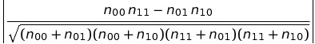

where *n<sub>ij</sub>* is the number of individuals in habitat *i* from ecotype *j*. This statistic will be close to 0 when both ecotypes are evenly distributed between the two habitats, but close to 1 if the two ecotypes each specialize in one habitat.

To compute the mating differentiation statistic, mating trials are conducted where `ntrials` male-female pairs are randomly sampled from the whole population (regardless of habitat) with replacement. For each pair, the female assesses and accepts or rejects the male. If the female accepts mating, we record the ecotype of both mates and classify this mating event as either homogamic (both are from the same ecotype) or heterogamic (both are from different ecotypes). From the total counts of homogamic and heterogamic mating events, we caculate a mating isolation statistic as:

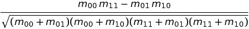

where *m<sub>ij</sub>* is the number of mating events between females of ecotype *i* and males of ecotypes *j*. Similar to the spatial isolation statistic, RI should be close to 0 if mating is random with respect to ecotype, and close to 1 if females strongly prefer their own ecotype. However, while SI is strictly positive, RI can become negative and will be close to -1 if the females have strong preferences for the alternative ecotype rather than their own.

### Variance decomposition

In addition to the *P<sub>ST</sub>* statistic used on trait *x* to infer ecological differentiation between the ecotypes, we calculated a series of analogous statistics to track, for each trait, how different portions of the phenotypic variance partition between the two ecotypes.  

Following the framework of quantitative genetics, phenotypic variance can be statistically decomposed into a variance explained by the environment and a variance explained by genetic differences, the latter of which can be further decomposed into a variance explained by additive genetics, a variance explained by dominance, and a variance explained by epistatic interactions, as follows:


Knowing the genotype, genetic and phenotypic value of every individual at every locus, we measured the different variance components on a per-locus and on a genome-wide basis. While the genome-wide genetic variance, *V<sub>G</sub>*, and phenotypic variance, *V<sub>P</sub>*, can be calculated from individuals' genetic and trait values, the genome-wide additive, dominance and interaction variance are the sums of locus-specific additive, dominance and interaction variances across all loci underlying the trait under consideration, because the decomposition of genetic variance requires a linear regression of genetic value on allele count, or genotype, which is a locus-specific property of an individual.  

For any given locus *i*, the genetic values *g<sub>i</sub>* are regressed against the allele counts at this locus, *q<sub>i</sub>* (which can be 0 for genotype *00*, 1 for genotype *01* or 2 for genotype *11*), according to the linear model:

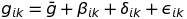

where 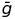 is the average genetic value across the population at locus *i*. 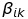 is the breeding value of individual *k* at locus *i*, or in other words, the deviation of individual *k* to the population average genetic value due to additive genetic effects of bearing its genotype *q<sub>ik</sub>*. The breeding value is calculated as 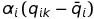, where  is the average allele count in the population, and 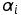 is the average effect of an allelic substitution at locus *i*, calculated as 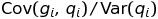 across the whole population. 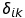 is the difference between the mean genetic value of individual *k*'s allele count, or genotype, group and the expected mean of this genotype group under pure additivity, i.e. the deviation from its group to the effect of the breeding value alone reflects the effect of dominance. 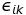 is the residual deviation from individual *k*'s genetic value at locus *i* to the average genetic value of its genotype group, and is attributed to epistatic interaction effects.

Additive variance was calculated as the variance in breeding values, while dominance and interaction variance components were calculated as the variances in deviations due to dominance, and residuals, respectively. These variance components were calculated at the whole population level, but also within ecotypes, in order to quantify variance partitioning between the ecotypes. Dominance and interaction variance were only calculated across ecotypes and not within. This is because we were only interested in measuring the partitioning of non-additive variance as a whole, mainly because within-ecotype variances in dominance and interaction effects are difficult to interpret. Instead, we calculate a non-additive variance component, *V<sub>N</sub>*, across and within ecotypes. Note that within-ecotype variances consider effects that were calculated from a regression performed on the whole population, because we are interested in how variance partitions within ecotypes relative to the whole population. We calculated genome-wide estimates of additive, dominance, interaction and non-additive variances as their respective sums across all loci encoding the trait of interest. Genome-wide variances were measured both within and across ecotypes, to calculate genome-wide differentiation statistics.

Similar to our ecological isolation metric, we used *P<sub>ST</sub>* to measure the extent of partitioning of the phenotypic variance between ecotypes, for each trait *x*, *y* and *z*, based on individuals' phenotypic values and on a per locus basis, where the phenotypic variance attributable to a given locus was the sum of its genetic variance and a small, single-locus environmental variance, defined as `scaleE`<sup>2</sup> / `nvertices` (for the trait under consideration). In an analogous way, we calculated *G<sub>ST</sub>* as the partitioning of the variance in genetic values between the ecotypes, *Q<sub>ST</sub>* as the partitioning of the variance due to additive genetic effects, and *C<sub>ST</sub>* for the variance due to non-additive effects. All these statistics are calculated in the same way as *P<sub>ST</sub>*, albeit with different variance components. All differentiation statistics were calculated one a per-locus and a genome-wide basis.  

## Parameters

Name | Definition
---|---
```rdynamics``` | whether the resources follow logistic (0) or a chemostat (1) dynamics
```inflow``` | rate of resource inflow in chemostat dynamics
```outflow``` | rate of resource outflow in chemostat dynamics
```capacity``` | resource carrying capacity in logistic dynamics
```replenish``` | resource growth rate in logistic dynamics
```hsymmetry``` | symmetry between the two habitats in resource carrying capacity or inflow rate
```ecosel``` | ecological selection coefficient
```dispersal``` | dispersal rate between habitats
```birth``` | expected number of offspring of a female with fitness 1
```survival``` | probability of an adult to survive to the next generation
```sexsel``` | strength of female mate preference
```matingcost``` | fitness cost of being choosy
```maxfeed``` | maximum achievable attack rate of an individual on a resource
```demesizes``` | initial population sizes of the two habitats
```nloci``` | number of loci in the genome
```nvertices``` | numbers of loci underlying each trait
```nedges``` | numbers of edges in the gene networks underlying each trait
```nchrom``` | number of chromosomes
```mutation``` | mutation rate per locus
```recombination``` | recombination rate (multiply by 100 to get genome size in centiMorgans)
```allfreq``` | frequency of allele 1 in the founder population
```scaleA``` | scaling parameter of additive effects for each trait
```scaleD``` | scaling parameter of dominance effects for each trait
```scaleI``` | scaling parameter of interaction effects for each trait
```scaleE``` | scaling parameter of environmental effects for each trait
```locusE``` | locus-specific environmental variance (initialize)
```skews``` | skew of the degree distributions of the gene networks underlying each trait
```effectshape``` | shape of the distribution of locus effect sizes
```effectscale``` | scale of the distribution of locus effect sizes
```interactionshape``` | shape of the distribution of gene interaction weights
```interactionscale``` | scale of the distribution of gene interaction weights
```dominancevar``` | variance of the distribution of locus dominance coefficients
```tburnin``` | duration of the burn-in period
```tend``` | duration of the simulation
```tsave``` | pace of data recording
```record``` | whether to record the data or not
```seed``` | seed of the random number generator
```ntrials``` | number of mating trials performed to compute mating isolation

