# ExplicitGenomeSpeciation

An individual-based simulation of an adaptive speciation event, with explicit full genomes and quantitative genetics.

## Model

### Environment

There are two habitats connected by dispersal, labelled 0 and 1. Two resources are present across the lanscape, also labelled 0 and 1. We assume that resource are not necessarily equally distributed between the habitats, but can be asymmetrically distributed. Resource 0 is the most abundant resource in habitat 0, while resource 1 is most abundant in habitat 1. The concentration of the most abundant resource is the same in each habitat. The least abundant resource in each habitat has a concentration that is a proportion ```hsymmetry``` of that of the most abundant resource, where ```hsymmetry``` can range from 0 (resources are equally distributed between habitats) to 1 (there is only one resource available in each habitat). The concentration of the least abundant resource is also the same between the habitats.

### Initialization

The founder population is populated with a certain number of individuals in each of the two habitats, defined by ```demesizes```. Founder individuals are generated with random genomes and therefore trait values may span a large range in the first time steps. This is not suitable for modelling e.g., a population that colonizes a new ecological niche, or resource, from a niche it is already adapted to. To model this scenario we incorporate a burn-in period in our simulation (of duration ```tburnin```), during which only resource 0 is available for use and there is no dispersal. If the population is initialized with all individuals in habitat 0, the burn-in period should canalize the population to specializing on resource 0, with ecological trait values gathered around -1. Once the burn-in period is over, the simulation runs for ```tend``` time steps where dispersal is allowed and both resources are available.

### Life cycle

The dynamics of the population unfold in discrete time. At every time step, the following events occur in the corresponding order: dispersal, consumption, reproduction and survival.

#### Dispersal

Every individual can migrate to the alternative habitat with probability ```dispersal```. There is no dispersal during the burn-in period.

#### Consumption

We assume that the resource dynamics are fast relative to the population dynamics. We calculate the equilibrium concentrations of each resource in each habitat as a steady state of the resource dynamics. We provide two ways to model resource flows: logistic (```rdynamics = 0```) or chemostat (```rdynamics = 1```) dynamics. The logistic dynamics are characterized by the following differential equation:

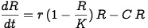

where *R* is the concentration of a given resource in a given habitat, *r* is the replenishment rate of the resource, *K* is the carrying capacity, and *C* is the consumption rate from the population. *C* is calculated as the sum of attack rates on this resource of all individuals in the present habitat. The chemostat dynamics are characterized by the equation:

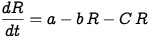

where *a* is the rate of inflow of resource in the habitat and *b* the rate of outflow. *C* is calculated the same way as for the logistic dynamics.  

The fitness of each individual is calculated as:

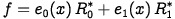

where *e<sub>0</sub>* and *e<sub>1</sub>* are the attack rates of the individual on each resource, given its ecological trait value *x*, and *R<sub>0</sub><sup>*</sup>* and *R<sub>1</sub><sup>*</sup>* are the equilibrium concentrations of the two resources in the individual's habitat. Note that only resource 0 is available during the burn-in period.

#### Reproduction

The fitness of individuals determines their reproductive success. At every generation, a mating seasons occurs for a number of discrete rounds, where females can choose males to mate with. It is possible that females remain unmated at the end of a mating season. The duration of the mating season is sampled each generation from a geometric distribution with parameter `matingcost`, which is the probability that the mating season will end after a given round. We recommend low values of `matingcost`, as to not strongly select against choosy females (who run high chances of not finding a mate if the mating season is too short).  

At each round of the mating season, females are presented with a male to assess. The probability of a male to encounter and being assessed by a females relative to other males is proportional to its fitness. Once encountered, the male is evaluated by the female, who can either accept or reject him as a mate. Once a female accepts a mate, the mating season ends for her and she produces a number of offspring sampled from a Poisson distribution with mean *f* `birth`, where `birth` is a baseline birth rate and *f* the fitness of the female.  

The probability to accept a given male depends on the female's mate preference *y* and on the male's ecological trait *x* value relative to her own. Positive values of *y* will favor assortative mating, i.e. with males that are more similar in ecological trait, while negative values will favor disassortative mating, i.e. with males that are more dissimilar in ecological trait. If *y = 0*, mating is random and the female will accept the first male she encounters. Specifically, the mating probability of female *i* with male *j* is given, for *y > 0*, by:

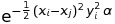

where 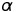 is the strength of sexual selection exerted by the females, controlled by parameter `sexsel` in the simulation. The mating probability in case *y < 0* is:

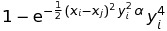

#### Survival

Adult individuals have a probability `survival` to survive to the next generation. The offspring that are just born in the current generation all survive and become adults at the beginning of the next generation.

### Genotype-to-phenotype map

#### Development

Every individual in the simulation is generated with a number of features, including phenotypic traits that are generated from explicit full genomes. We model three traits, *x*, an ecological trait determining the attack rates of an individual on both resources, *y*, a mate preference trait used in reproduction, and *z*, a neutral trait with no particular function, to serve as a control. Each individual bears a full diploid genome of `nloci` genes, where each gene is represented by two bits, one for each haplotype. Each bit is an allele at this particular gene. The possible genotypes at any given gene are therefore *00*, *01* and *11*.  

Each phenotypic trait is encoded by multiple genes. The number of genes underlying each trait is given by `nvertices`, a vector of length three. The sum of the elements in `nvertices` is `nloci`. The genes underlying a given trait are scattered uniformly across the genome. This is done by shuffling randomly a vector of length `nloci` with elements indicating encoded traits, where each trait is present in a number of copies determined in `nvertices`. The value of a given trait for a given individual is the sum of an environmental and a genetic effect. The environmental effect is modelled as noise, sampled from a normal distribution with mean zero and standard deviation given by `scaleE` (which is a vector with one value per trait). The genetic effect is calculated as a sum of contributions from all the genes that code for the trait. The contribution of a single gene to the phenotype it encodes is the genetic value of that gene, denoted *g<sub>ik</sub>* for locus *i* in individual *k*, and is computed as:

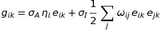

where 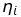 is the effect size of locus *i* on its own, 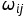 is the effect size of the epistatic interaction between gene *i* and *j* (both genes code for the same trait), and *e<sub>ik</sub>* is the gene expression level of locus *i* in individual *k*. The first term of the equation can be seen as the independent contribution of locus *i*, while the second term incorporates the effect of interactions with other genes in the genome. Parameters 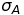 and 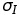 are scaling parameters for both the independent part and the epistatic part, and are given by `scaleA` and `scaleI` (they both are vectors of length three, one value per trait).  and  are part of the genetic architecture, which is fixed throughout the simulation (it cannot evolve) and is determined before the simulation starts. Values of  are sampled for each locus from a two-sided Gamma distribution with parameters `effectshape` and `effectscale`, which are constant across the genome. Some genes therefore have positive and others negative contributions to the final trait value. For each pair of interacting genes,  is also sampled from a two-sided Gamma distribution, with parameters `interactionshape` and `interactionscale`, which are also constant across all gene-gene interactions. The gene expression level *e<sub>ik</sub>* depends on the genotype of individual *k* at locus *i*. We assume that genotypes *00* have an expression level of -1 and genotypes *11* have an expression level of 1, thereby viewing alleles *0* and *1* as inactive *versus* active, or inhibiting *versus* enhancing, versions of genes. The expression level of heterozygous genotype *01* (we do not make a difference between *01* and *10*) is 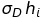, where *h<sub>i</sub>* is the dominance coefficient at locus *i*, and 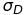 is a scaling parameter determined by `scaleD` (again one value for each trait). Dominance coefficients are part of the fixed genetic architecture and are sampled at the beginning of the simulation, for each locus, from a positive half-normal distribution, where the underlying normal distribution has mean zero and standard deviation `dominancevar`. Dominance coefficients therefore reflect the dominance of allele *1* over allele *0*, such that if *h<sub>i</sub> = 0*, the expression level of the heterozygote is exactly 0, and expression gets closer to 1 as *h<sub>i</sub>* gets closer to 1. WEIRD that expression of the heterozygote cannot be negative.  

Once the trait values of the genetically encoded phenotypes are known, the attack rates of a given individual on a given resource *r* (0 or 1) are calculated from its ecological trait value *x* as:

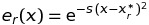

where *s* is the ecological selection coefficient, a parameter controlled by `ecosel`, and *x<sub>r</sub><sup>*</sup>* is the value of the ecological trait *x* for which the attack rate on resource *r* is maximized. In other words, it is the optimal trait value for feeding on resource *r*. We assume that *x<sub>0</sub><sup>*</sup> = -1* and *x<sub>1</sub><sup>*</sup> = 1*. The ecological selection coefficient *s* determines the strength of the trade-off between being adapted to resource 0 and being adapted to resource 1. Disruptive selection can be modelled by increasing *s*. As *s* increases, the overlap between the two Gaussian attack rate curves along the *x* axis decreases. This means that individuals with intermediate value of the *x* (close to 0) phenotype will have poor attack rates on both resources, while individuals with extreme values (close to -1 or 1) have high attack rates on one of the two resources, and have a higher payoff than intermediate individuals, who will be selected against. If *s = 0*, there is no selection and the attack rate on both resources is 1, regardless of the value of *x*.

#### Gene interaction networks
 
## Parameters

Name | Definition
---|---
```rdynamics``` | whether the resources follow logistic (0) or a chemostat (1) dynamics
```inflow``` | rate of resource inflow in chemostat dynamics
```outflow``` | rate of resource outflow in chemostat dynamics
```capacity``` | resource carrying capacity in logistic dynamics
```replenish``` | resource growth rate in logistic dynamics
```hsymmetry``` | symmetry between the two habitats in resource carrying capacity or inflow rate
```ecosel``` | ecological selection coefficient
```dispersal``` | dispersal rate between habitats
```birth``` | expected number of offspring of a female with fitness 1
```survival``` | probability of an adult to survive to the next generation
```sexsel``` | strength of female mate preference
```matingcost``` | fitness cost of being choosy
```maxfeed``` | maximum achievable attack rate of an individual on a resource
```demesizes``` | initial population sizes of the two habitats
```nloci``` | number of loci in the genome
```nvertices``` | numbers of loci underlying each trait
```nedges``` | numbers of edges in the gene networks underlying each trait
```nchrom``` | number of chromosomes
```mutation``` | mutation rate per locus
```recombination``` | recombination rate (multiply by 100 to get genome size in centiMorgans)
```allfreq``` | frequency of allele 1 in the founder population
```scaleA``` | scaling parameter of additive effects for each trait
```scaleD``` | scaling parameter of dominance effects for each trait
```scaleI``` | scaling parameter of interaction effects for each trait
```scaleE``` | scaling parameter of environmental effects for each trait
```locusE``` | locus-specific environmental variance (initialize)
```skews``` | skew of the degree distributions of the gene networks underlying each trait
```effectshape``` | shape of the distribution of locus effect sizes
```effectscale``` | scale of the distribution of locus effect sizes
```interactionshape``` | shape of the distribution of gene interaction weights
```interactionscale``` | scale of the distribution of gene interaction weights
```dominancevar``` | variance of the distribution of locus dominance coefficients
```tburnin``` | duration of the burn-in period
```tend``` | duration of the simulation
```tsave``` | pace of data recording
```record``` | whether to record the data or not
```seed``` | seed of the random number generator
```ntrials``` | number of mating trials performed to compute mating isolation

