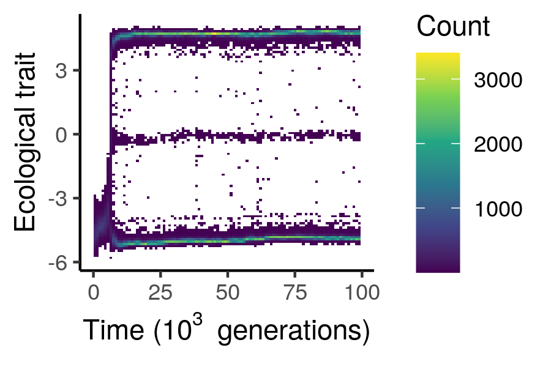
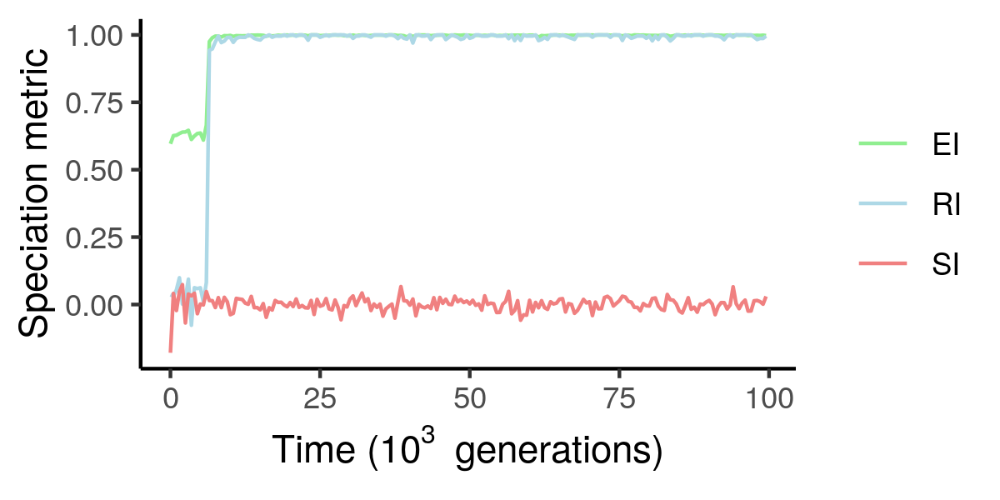
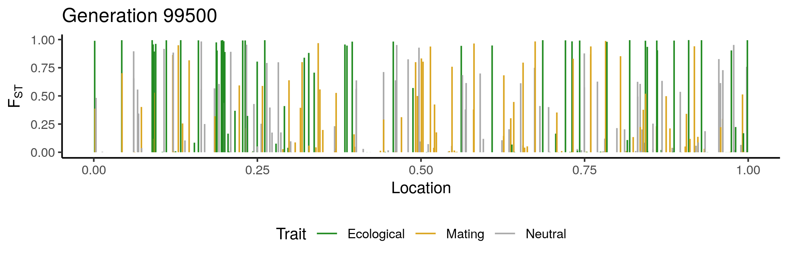
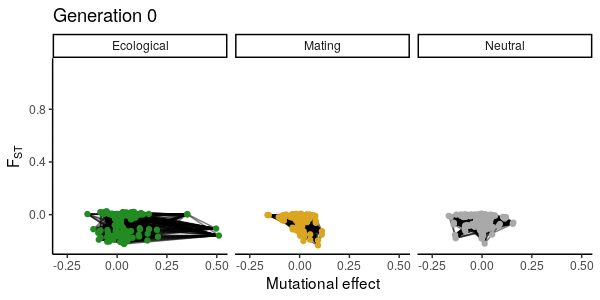

# ExplicitGenomeSpeciation

Individual-based simulation of adaptive speciation with explicit genomes and genotype-phenotype map.

## Model description

This is an individual-based simulation of a population of sexual organisms evolving in a system with two habitats linked by dispersal. Individuals can utilize two resources in their environment, and the abundances of these resources between the two habitats can be tuned. Through genetic evolution, the organisms can adapt to utilize different resources, and under some circumstances this can lead to adaptive speciation, where two reproductively isolated species emerge from a single one. 

There are three quantitative traits in the model: an ecological one, a mating one and a neutral one. The ecological trait determines utilization efficiency of the two resources, which can be subject to a trade-off such that no individual can be efficient at utilizing both resources. The mating trait controls the sexual preference of females for more ecologically similar (when positive) or dissimilar (when negative) males. The target of mate choice is the ecological trait, which makes it a magic trait. The neutral trait is here for control. 

Each individual has a diploid genome with a discrete number of loci, which come in either of two alleles: 0 and 1. There are loci coding for each of the three traits, and so the evolution of these traits depend on evolution at the genomic level under mutation, selection, drift, migration and recombination.

This model implements different kinds of genotype-phenotype mapping scenarios (i.e. how the loci code control the traits of the individuals), encompassing the main sources of genetic variation from quantitative genetics: additive, dominance, epistatic and environmental effects. To accomodate epistatic effects in particular, each trait has its own gene regulatory network, which can be built by the simulation using a preferential attachment algorithm, or specified externally, together with the additive effects, dominance coefficients, encoded traits and locations of the loci. 

The simulation can record a whole lot of variables, from the degree of reproductive isolation between the species to the genetic differentiation at each gene in the genome, and more. It can be used to test whether different genetic architectures equally lead to speciation, or to explore the traces that are left in the genome as speciation happen, in order to maybe help empiricists make better sense of the patterns found in nature.

## About

This program was written in C++14 in QtCreator 4.9.2 (Qt 5.12.4) on Ubuntu 18.04 LTS, but should run on other platforms too.

## Status

Branch|[](https://travis-ci.org)|[](https://www.codecov.io)
---|---|---
master|[](https://travis-ci.org/rscherrer/ExplicitGenomeSpeciation)|[](https://codecov.io/github/rscherrer/ExplicitGenomeSpeciation/branch/master)
develop|[](https://travis-ci.org/rscherrer/ExplicitGenomeSpeciation)|[](https://codecov.io/github/rscherrer/ExplicitGenomeSpeciation/branch/develop)
raph|[](https://travis-ci.org/rscherrer/ExplicitGenomeSpeciation)|[](https://codecov.io/github/rscherrer/ExplicitGenomeSpeciation/branch/raph)
thijs|[](https://travis-ci.org/rscherrer/ExplicitGenomeSpeciation)|[](https://codecov.io/github/rscherrer/ExplicitGenomeSpeciation/branch/thijs)
richel|[](https://travis-ci.org/rscherrer/ExplicitGenomeSpeciation)|[](https://codecov.io/github/rscherrer/ExplicitGenomeSpeciation/branch/richel)

## Snapshots

These are some possible outcomes of the model (produced in R):

 



## Build

Build the main file `main.cpp` with your favorite compiler. All the additional source and header files needed are all in `library`. Alternatively you can find executable binaries in the folder `bin`, presently available for Linux only (gotta do that).

## Usage

The program has a command-line interface (CLI). Running it on its own will run a simulation with default parameters (see below). Non-default parameters can be specified by providing a parameter file, i.e. a text file containing on each row the name of a parameter and the value it should take (e.g. `mutation 0.0001`). It should look something like:

```
./EGS parameters.txt
```

## Parameters

Non-default parameters are supplied in a parameter file. The parameter file must contain on each line, the name of one parameter followed by a blank (e.g. space or tab) and the value(s) that this parameter must take. Parameter names must match those in the table. Parameters that are not in the parameter file will take default values. Parameters that take multiple values must be supplied as such, with values separated by blanks (e.g. `nvertices 30 30 30`).

We describe the different parameters (and their default value).

Ecological parameters:

* `rdynamics` (default 1) is the type of resource dynamics (0 for *logistic dynamics*, which assume a biotic resource with an intrinsic growth and a carrying capacity, or 1 for *chemostat dynamics* with and inflow and outflow of some abiotic resource)
* `replenish` (2375) and `capacity` (1) are the growth rate and carrying capacity, respectively, of the resources assuming logistic dynamics (`rdynamics 0`)
* `inflow` (400) and `outflow` (100) are the absolute inflow and relative outflow rates of the resources, respectively, assuming chemostat dynamics (`rdynamics 1`)
* `hsymmetry` (0) is the degree of homogeneity in resource distribution between the two habitats. It basically is a scaling factor to make the realized `replenish` (if logistic resource dynamics) or `inflow` (if chemostat resource dynamics) differ between the habitats, ranging between 0 and 1
* `ecosel` (1.8) is the ecological trade-off in utilization between the two resources. It must be zero or positive, and the higher it is, the less efficient is utilizing both resources instead of specializing on a single one
* `demesizes` (100, 0) are the number of individuals initialized in both habitats, respectively
* `dispersal` (0.01) is the proportion of individuals sampled to switch habitats every generation
* `birth` (1) is the base birth rate per female, independent of fitness
* `survival` (0.8) is the probability of survival of adult individuals from one generation to the next (it takes one generation for newborns to become adults)
* `sexsel` (10) is the sexual selection coefficient, a positive number mediating the general degree of choosiness of females towards males during the mating season
* `matingcost` (0.01) is the fitness cost of choosy females (that run the risk of remaining unmated)
* `ntrials` (100) is the number of mating trials to perform to measure the degree of reproductive isolation between the species

Genetic parameters:

* `nvertices` (30, 30, 30) and `nedges` (30, 0, 0) are the numbers of loci and edges, respectively, in each of the three gene networks (one for each trait in the following order: ecological, mating and neutral). `nvertices` must be at least 2 for each trait, and `nedges` cannot be higher than n (n - 1) / 2 (complete graph), if n is the number of vertice for a given trait. In practice, the preferential attachment algorithm may fail to attach all the requested edges of the network if nedges is close to the maximum possible number of edges. In this case the program will return an error. The number of edges should be at least n-1, which ensures that the network is connected (all the nodes are attached).
* `nchrom` (3) is the number of equally sized chromosomes
* `mutation` (0.001) is the mutation rate per locus
* `recombination` (3) is the recombination rate and corresponds more or less to the average number of crossovers during one recombination event. It is actually the rate of an exponential distribution describing the distance between successive crossover points
* `allfreq` (0.2) is the initial frequency of the 1-allele in the population
* `scaleA` (1, 1, 1), `scaleD` (0, 0, 0), `scaleI` (0, 0, 0) and `scaleE` (0, 0, 0) are scaling factors for each source of phenotypic variation in the quantitative genetics framework, i.e. additive, dominance, epistatic and environmental effects, respectively, for each of the three traits
* `skews` (1, 1, 1) are the skewnesses of each of the three gene networks
* `effectshape` (2) and `effectscale` (1) are the parameters of the distribution of additive effect sizes across loci. If the resulting distribution has variance 0, all the loci are assigned effect size 1
* `interactionshape` (5) and `interactionscale` (1) are the parameters of the distribution of epistatic interaction weights across edges. If the resulting distribution has variance 0, all the edges are assigned interaction weight 1 
* `dominancevar` (1) is the standard deviation of the distribution of dominance coefficients across loci. If 0, all the loci are assigned dominance coefficient 1

General simulation parameters:

* `tburnin` (0) is the duration of the burn-in period, in generations
* `tend` (10) is the number of generations to simulate (after burn-in)
* `tsave` (10) is the frequency at which to record the data
* `tfreeze` (100) is the frequency at which to save the whole genomes of all individuals (separate because it takes a lot of space)
* `talkative` (1) is either 0 or 1 and sets whether the simulation should print status information to the prompt
* `record` (1) is either 0 or 1 and sets whether to record the data at all every `tsave` and `tfreeze` generations
* `choosewhattosave` (0) is either 0 or 1 and sets whether the variables to save are specified in a separate file, the order file (see below). If 0 all of the output variables are saved every `tsave` generations except for whole genomes
* `datsave` (1) sets whether to save the recorded variables (if `record` is 1) to files
* `gensave` (0) is either 0 or 1 and sets whether whole genomes should be saved every `tfreeze` generations
* `archsave` (0) is either 0 or 1 and sets whether the genetic architecture should be saved into a file (see below)
* `archload` (0) sets whether the genetic architecture of the simulation should be loaded from a file instead of generated anew
* `parsave` (1) sets whether to save the parameters of the simulation run to file, including the random seed
* `archfile` (architecture.txt) is the name of the architecture file where the details of the genetic architecture must be loaded from, if `archload` is 1
* `parfile` (paramlog.txt) is the name of the output parameter file where to save the parameters of the current simulation, if `parsave` is 1. This can be used e.g. to retrieve a random seed
* `orderfile` (whattosave.txt) is the name of the order file where the list of variables to save is specified, if `choosewhattosave` is 1
* `logfile` (log.txt) is the name of a file capturing the console output of the simulation
* `seed` is the seed of the random number generator, and it is by default randomly generated based on the clock

# Architecture file

An architecture file must have a specific organization to be loaded successfully. It is a text file consisting of a series of fields, each directly followed by a line break and a series of numbers to be loaded into that field, separated by blanks. The fields are:

* chromosomes: the location of the end of each chromosome between the start and end of the genome. Make sure that the number of values equals nchrom of the simulation you are going to launch.

* traits: the trait encoded by each locus

* locations: the location of each locus along the genome

* effects: the effect-size of each locus

* dominances: the dominance coefficient of each locus

Make sure that the locus-specific fields have as many values as there are vertices in the simulation you want to run.

Each gene network has its own field named "network" followed by the trait encoded by the network (0, 1 or 2) and the number of edges in that network, all separated by blanks. Those network headers are followed by a line break and several subfields, each followed by their series of blank-separated values.

* weights: the interaction weight of each edge

* edge0: the first interaction partner locus for each edge

* edge1: the second interaction partner locus for each edge

Fields and subfields are separated from each other by line breaks.

You will rarely have to make your own architecture file manually. The most common use case is to run a simulation with the archsave flag, save the genetic architecture in the file, and then re-use this architecture in another simulation with the archload flag and the same file.

## Order file

This optional file contains a list of names of variables to save, if record, datsave and choosewhattosave are all 1. Each variable is saved as a series of 64bit double precision floating point numbers in a binary file with the .dat extension (and so needs to be decoded to be read). This is to optimize space use and read / write speed. There is no saving during the burn-in period. The possible variables are:

| Variable | Meaning | Values per timepoint |
|----|:----:|----:|
| time | Generation | 1 |
| population_size | Number of individuals | 1 |
| ecotype_size | Ecotype population size | 1 per ecotype |
| resources | Equilibrium resource concentrations | 1 per habitat per resource |
| means | Mean trait values | 1 per trait |
| ecotype_means | Ecotype-mean trait values | 1 per trait per ecotype |
| varP | Phenotypic variance | 1 per trait |
| varG | Genetic variance | 1 per trait |
| varA | Additive variance | 1 per trait |
| varD | Dominance variance | 1 per trait |
| varI | Interaction variance | 1 per trait |
| varN | Non-additive variance | 1 per trait |
| varT | Variance in allele frequencies | 1 per trait |
| Pst | Phenotypic differentiation | 1 per trait |
| Gst | Genetic effect differentiation | 1 per trait |
| Qst | Additive effect differentiation | 1 per trait |
| Cst | Non-additive effect differentiation | 1 per trait |
| Fst | Genotypic differentiation | 1 per trait |
| EI | Ecological isolation | 1 |
| SI | Spatial isolation | 1 |
| RI | Reproductive isolation | 1 |
| genome_varP | Locus-specific phenotypic variance | 1 per locus |
| genome_varG | Locus-specific genetic variance | 1 per locus |
| genome_varA | Locus-specific additive variance | 1 per locus |
| genome_varD | Locus-specific dominance variance | 1 per locus |
| genome_varI | Locus-specific interaction variance | 1 per locus |
| genome_varN | Locus-specific non-additive variance | 1 per locus |
| genome_Pst | Locus-specific Pst | 1 per locus |
| genome_Gst | Locus-specific Gst | 1 per locus |
| genome_Qst | Locus-specific Qst | 1 per locus |
| genome_Cst | Locus-specific Cst | 1 per locus |
| genome_Fst | Locus-specific Fst | 1 per locus |
| genome_alpha | Locus-specific average mutational effect | 1 per locus |
| genome_meang | Locus-specific mean genetic value | 1 per locus |
| genome_freq | Locus-specific allele frequency | 1 per locus |
| genome_freqs | Locus-specific within-ecotype allele frequency | 1 per locus per ecotype |
| genome_hobs | Locus-specific within-ecotype heterozygosity | 1 per locus per ecotype |
| network_corgen | Edge-specific correlation in genetic values | 1 per edge |
| network_corbreed | Edge-specific correlation in breeding values | 1 per edge |
| network_corfreq | Edge-specific correlation in allele frequencies | 1 per edge |
| network_avgi | First-partner edge-specific epistatic variance in average effect | 1 per edge |
| network_avgj | Second-partner edge-specific epistatic variance in average effect | 1 per edge |
| individual_ecotype | Individual ecotype | 1 per individual |
| individual_habitat | Individual habitat | 1 per individual |
| individual_trait | Individual trait values | 1 per individual per trait |
| individual_midparent | Individual midparent trait values | 1 per individual per trait |

(Edges are ordered by trait.)

Note that if you are choosing what variables to save, it is important to save "time" because the functions provided in the accompanying R package for analyses assume that this file is present. Also note that if you are going to save individual data, you may want to save "population_size" for the same reason.

## Saving full genomes

It is possible to save the full genomes of every individual every `tfreeze` time step, if `gensave` is set to 1. The option to save full genomes cannot be specified in the order file mentioned above. This means that the output file `freezer.dat`, containing these data, will automatically be generated every time the simulation runs. To not save anything in it, just set `ensave` to 0 and/or `tfreeze` to some time point greater than `tend`, this way, the condition for saving full genomes will never be met.

Each value in a full genome is an allele at a specific position along one of the two haplotypes of that individual. Therefore, a genome contains twice as many values as there are loci, because the organisms are diploid. Each value is either 0 or 1 (the two possible alleles). Haplotypes are saved in turns, such that the first N values are all alleles of the first haplotype and the next N values are all alleles of the second haplotype, if N is the total number of loci. This does not mean that each saved individual genome is exactly 2N values long, though. In order to save space for this large amount of data, individual genomes are first split into blocks of 64 bits, and each block is converted into a 64bit integer, which is then saved to the `freezer` output file as binary. Therefore, the `freezer` output file must be interpreted on a bit-wise basis in order to retrieve the actual alleles of the individual (i.e. reading it as 64bit integers will show integer equivalents of chunks of 64 alleles). This also means that for each individual, a multiple of 64 bits will be written to the file, even if 2N alleles is not necessarily a multiple of 64. In other words, for each individual 2N bits will be written to file, and the remaining part of the last 64bit-chunk will be filled with zeros.

## Analysis with egssimtools

The program comes with the R package `egssimtools`, which contains useful functions to read and process the data generated during the simulations. It is particularly handy to convert the binary data files saved by the program into workable data sets and vectors. The package comes with a vignette explaining how to use it. Check out the [vignette](egssimtools/doc/vignette.pdf) in `egsimtools/doc`.

## Use on the Peregrine cluster

Check out the README in folder `cluster`.

## GUI

GUI Tabs:


Extended coloration of histograms (Update 29-10-2019):


## Downloads

 * [Windows executable](http://richelbilderbeek.nl/EGS_gui.zip)

## Extra

Alternatively, an `EGS` pre-compiled executable is available in the root directory. This executable was built by running the `build_target.sh` script on the Peregrine HPC Linux cluster of the University of Groningen, following the instructions in `cluster/README.md` (QMake version 3.1 from Qt version 5.14.1). This executable should run on a Linux machine, not sure about other platforms...

## Disclaimer

This simulation program was used to get insights into the effect of the genetic architecture on the process of speciation. It was not designed as a statistical inference package or a data processing tool, although its simulations could in theory be used for training machine learning algorithms to recognize various evolutionary scenarios.

This code comes with no guarantee whatsoever.

## Permissions

Copyright (c) Raphael Scherrer and G. Sander van Doorn, 2019
