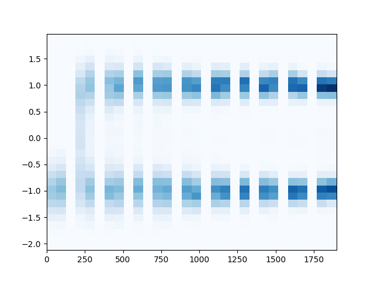
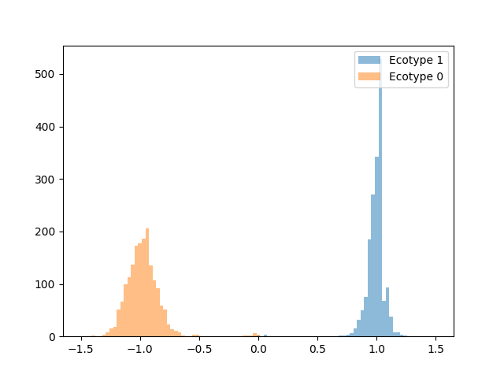

# ExplicitGenomeSpeciation GUI version

Branch|[](https://travis-ci.org)|[](https://www.codecov.io)
---|---|---
master|[](https://travis-ci.org/rscherrer/ExplicitGenomeSpeciation)|[](https://codecov.io/github/rscherrer/ExplicitGenomeSpeciation/branch/master)
develop|[](https://travis-ci.org/rscherrer/ExplicitGenomeSpeciation)|[](https://codecov.io/github/rscherrer/ExplicitGenomeSpeciation/branch/develop)
raph|[](https://travis-ci.org/rscherrer/ExplicitGenomeSpeciation)|[](https://codecov.io/github/rscherrer/ExplicitGenomeSpeciation/branch/raph)
thijs|[](https://travis-ci.org/rscherrer/ExplicitGenomeSpeciation)|[](https://codecov.io/github/rscherrer/ExplicitGenomeSpeciation/branch/thijs)
richel|[](https://travis-ci.org/rscherrer/ExplicitGenomeSpeciation)|[](https://codecov.io/github/rscherrer/ExplicitGenomeSpeciation/branch/richel)

ExplicitGenomeSpeciation is a program that simulates the evolution of a species using individual-based modelling and incorporating explicit genomes and a flexible genotype-phenotype map.

# Example simulations






# Folder structure

The repository has the following folder structure:

* `ci`: Bash files needed by Travis for continuous integration to GitHub.
* `library`: headers and source code for the simulation
* `tests`: headers and source code for the tests
* `gui`: headers and source code for the graphical user interface (GUI)
* `cluster`: scripts to use the program on the Peregrine cluster

# Download the program

Download the repository by clicking the green button on the top right corner of the main GitHub page. Alternatively, you can download it from the command line using Git:

```{bash}
git clone https://github.com/rscherrer/ExplicitGenomeSpeciation
```

Then navigate to the repository to access the program.

# Build the program

The program was written in standard C++14 on Ubuntu 18.04 using QtCreator. The project file `EGS.pro` contains all build instructions that were used to compile the program. The project file `EGS_test.pro` contains the build instructions for the debug version, which runs tests and assertions. Tests were written using the Boost.Test library. The project file `EGS_gui` contains the instructions for building the GUI. Qt is needed to build either of these versions from the `.pro` files. Alternatively you can build the program from source with the compiler of your choice.

# Run the program

To run the program from the command line, use

```{bash}
./EGS
```

For non-default parameters you have to provide them in a parameter file, like this:

```{bash}
./EGS parameters.txt
```

# Parameters

| Parameter | Meaning | Default |
|----|:----:|----:|
| rdynamics | Type of resource dynamics | 1 |
| capacity | Resource carrying capacity | 1.0 |
| replenish | Resource replenishment rate | 2375.0 |
| inflow | Resource inflow rate | 400.0 |
| outflow | Resource outflow rate | 100.0 |
| hsymmetry | Habitat symmetry | 0.0 |
| ecosel | Ecological divergent selection | 1.8 |
| dispersal | Dispersal rate | 1.0E-2 |
| birth | Birth rate | 1.0 |
| survival | Survival rate | 0.8 |
| sexsel | Sexual selection coefficient | 10.0 |
| matingcost | Cost of mate choice | 0.01 |
| demesizes | Initial population sizes | 100 0 |
| nvertices | Numbers of loci | 30 30 30 |
| nedges | Numbers of edges | 30 0 0 |
| nchrom | Number of chromosomes | 3 |
| mutation | Mutation rate | 1.0E-3 |
| recombination | Recombination rate | 3.0 |
| allfreq | Initial allele frequency | 0.2 |
| scaleA | Additive scaling parameter | 1.0 1.0 1.0 |
| scaleD | Dominance scaling parameter | 0.0 0.0 0.0 |
| scaleI | Interaction scaling parameter | 0.0 0.0 0.0 |
| scaleE | Environmental scaling parameter | 0.0 0.0 0.0 |
| skews | Gene network skewness | 1.0 1.0 1.0 |
| effectshape | Shape of the effect-size distribution | 2.0 |
| effectscale | Scale of the effect-size distribution | 1.0 |
| interactionshape | Shape of the interaction weight distribution | 5.0 |
| interactionscale | Scale of the interaction weight distribution | 1.0 |
| dominancevar | Scale of the dominance coefficient distribution | 1.0 |
| tburnin | Duration of the burn-in | 0 |
| tend | Duration of the simulation | 10 |
| tsave | Frequency of data recording | 10 |
| tfreeze | Frequency of individual whole genome sequencing | 100 |
| talkative | Verbose during the simulation | 1 |
| record | Whether to record data | 1 |
| datsave | Whether to save data | 1 |
| choosewhattosave | Whether to choose what variables to save | 0 |
| gensave | Whether to save individual whole genomes | 0 |
| archsave | Whether to save genetic architecture | 0 |
| archload | Whether to load architecture from a file | 0 |
| parsave | Whether to save parameters | 1 |
| archfile | Architecture file | architecture.txt |
| parfile | Parameter log file | paramlog.txt |
| orderfile | File listing variables to save | whattosave.txt |
| seed | Random seed | randomly generated |  
| ntrials | Number of mating trials | 100 |


# Use on the cluster

Check out the README in folder `cluster`.

# GUI

GUI Tabs:


Extended coloration of histograms (Update 29-10-2019):


# Downloads

 * [Windows executable](http://richelbilderbeek.nl/EGS_gui.zip)

